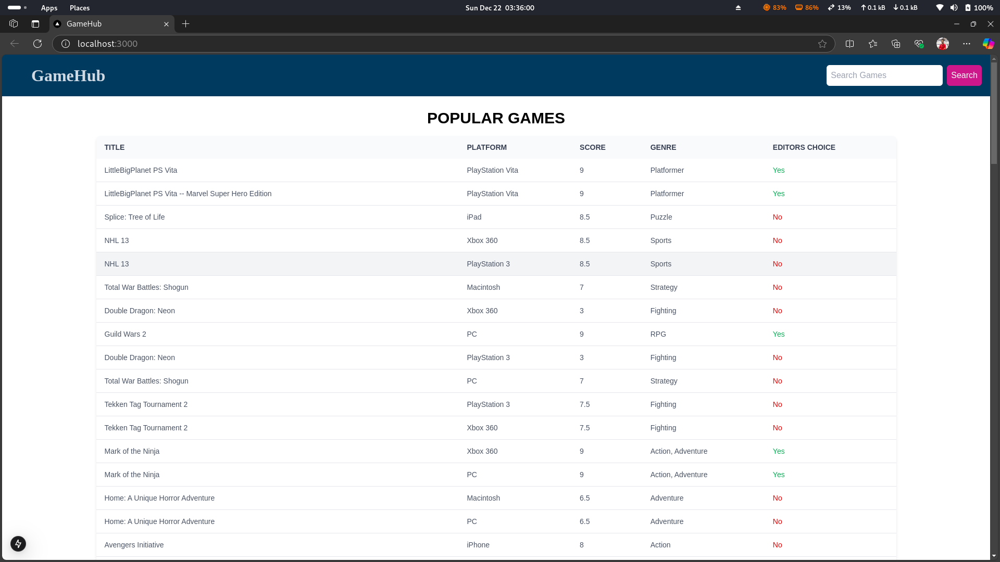

# GameHub

GameHub is a front-end application developed using Next.js that allows users to list and browse games developed for different platforms conveniently. The application fetches game details from a provided Web API and displays them interactively.

## Features

- Visually interactive listing of all the games
- Sorting games based on platform
- Autocomplete search with game title

## Parameters Overview

- **Title**: Title of the game
- **Platform**: Name of the platform from where the game is designed
- **Score**: Game rating score
- **Genre**: Genre of the game
- **Editors_choice**: Whether the game is an editor's choice or not

## Evaluation Criteria

- Use React Bootstrap OR Tailwind as UI Framework
- Proper use of the life cycle of React
- Proper naming conventions, commenting, and variable names in components (Code standards)
- Follow a component-based approach so each feature (listing, auto-suggestion search, filter) is represented with a component

## Installation

1. Clone the repository:
    ```bash
    git clone https://github.com/HariMalam/gamehub.git
    ```
2. Navigate to the project directory:
    ```bash
    cd gamehub
    ```
3. Install dependencies:
    ```bash
    npm install
    ```
4. Run the development server:
    ```bash
    npm run dev
    ```

## Usage

Open [http://localhost:3000](http://localhost:3000) with your browser to see the result.

## Screenshots



## License

This project is licensed under the MIT License.

## Acknowledgements

- [Next.js](https://nextjs.org/)
- [Tailwind CSS](https://tailwindcss.com/)

## Web API

The application fetches game details from the following Web API:

[https://s3-ap-southeast-1.amazonaws.com/he-public-data/gamesarena274f2bf.json](https://s3-ap-southeast-1.amazonaws.com/he-public-data/gamesarena274f2bf.json)
